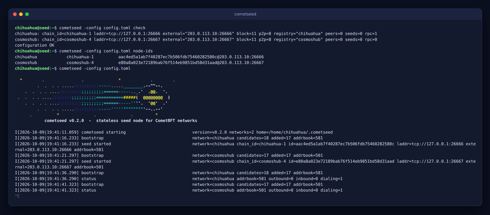

# cometseed

A stateless seed node for CometBFT networks.



cometseed speaks only the CometBFT p2p PEX protocol. For each configured network it crawls the
peers to build an address book, hands addresses to the nodes that connect to it and then
disconnects them, like any seed node. It needs no chain binary, no blocks and no application
state, so one small process can serve any number of chains, each on its own port.

- **One binary for every CometBFT chain**: only the chain id and the protocol versions matter.
- **One TOML file**: one `[[network]]` per chain.
- **Automatic bootstrap** from the [Cosmos chain registry](https://github.com/cosmos/chain-registry)
  (seeds, persistent peers and the `/net_info` of the listed RPCs), from your own nodes'
  `/net_info`, or from fixed peers and seeds.
- **systemd in one command**: `cometseed service install` / `update` / `uninstall`.
- **Monitoring**: optional `/status` (JSON), `/metrics` (Prometheus) and `/healthz`.

## Contents

- [Install](#install)
- [Quick start](#quick-start)
- [Configuration](#configuration)
- [Run as a systemd service](#run-as-a-systemd-service)
- [Publish the seed](#publish-the-seed)
- [Monitoring](#monitoring)
- [Commands](#commands)
- [Compatibility](#compatibility)
- [Troubleshooting](#troubleshooting)

## Install

Build it (Go 1.25 or newer):

```sh
git clone https://github.com/woof-chihuahua/cometseed.git
cd cometseed
CGO_ENABLED=0 go build -trimpath -ldflags "-s -w -X main.buildVersion=$(git describe --tags --always)" -o cometseed .
install -m 755 cometseed ~/.local/bin/cometseed     # or /usr/local/bin
cometseed version
```

The binary is static: copy it to any Linux host of the same architecture
(`GOARCH=arm64` builds for ARM).

## Quick start

A seed for Chihuahua in four commands:

```sh
mkdir -p ~/cometseed && cd ~/cometseed
cometseed example-config > config.toml   # every option, documented
$EDITOR config.toml                      # set laddr and external_address
cometseed -config config.toml check      # validate and resolve the registry entries
cometseed -config config.toml            # run it
```

The shortest useful configuration:

```toml
[[network]]
chain_registry = "chihuahua"             # chain id and bootstrap peers from the registry
laddr = "tcp://0.0.0.0:26666"
external_address = "seed.chihuahua.wtf:26666"
```

Two chains from the same process, each on its own port:

```toml
[[network]]
name = "chihuahua"
chain_registry = "chihuahua"
laddr = "tcp://0.0.0.0:26666"
external_address = "seed.chihuahua.wtf:26666"
bootstrap_rpc = ["http://127.0.0.1:26657"]   # your own node, if it runs on the same host

[[network]]
name = "cosmoshub"
chain_registry = "cosmoshub"
laddr = "tcp://0.0.0.0:26667"
external_address = "seed.chihuahua.wtf:26667"
```

A chain that is not in the registry only needs its chain id and a bootstrap source:

```toml
[[network]]
chain_id = "chihuahua-1"
laddr = "tcp://0.0.0.0:26666"
external_address = "seed.chihuahua.wtf:26666"
bootstrap_rpc = ["http://127.0.0.1:26657"]
peers = ["b280037a0039eb3f021b1231135a6f9d69194649@seed.chihuahua.wtf:26666"]
```

## Configuration

[`config.example.toml`](config.example.toml) lists every option with its default
(`cometseed example-config` prints it). In short:

| Section | Option | Default | |
| --- | --- | --- | --- |
| top level | `home` | `~/.cometseed` | node keys and address books, `<home>/<network>/` |
| | `log_level` | `p2p:none,addrbook:error,pex:error,*:info` | global or per module (`module:level,*:level`) |
| | `log_format` | `plain` | `plain` or `json` |
| `[http]` | `listen` | off | `/status`, `/metrics`, `/healthz`, e.g. `127.0.0.1:26680` |
| `[chain_registry]` | `url` | cosmos/chain-registry on GitHub | any mirror with the same layout |
| | `timeout` | `20s` | |
| `[defaults]` | `max_inbound` | `1000` | inbound connections |
| (and per network) | `max_outbound` | `30` | crawler connections |
| | `bootstrap_interval` | `30m` | refresh from the bootstrap sources, `0s` disables |
| | `bootstrap_rpc_timeout` | `15s` | per `/net_info` request |
| | `addr_book_strict` | `true` | keep only routable addresses |
| | `allow_duplicate_ip` | `true` | several peers behind one IP |
| | `seed_disconnect_wait` | `28h` | before re-crawling a peer |
| | `send_rate`, `recv_rate` | `5120000` | bytes/s per connection |
| | `registry_seeds`, `registry_peers`, `registry_rpc` | `true` | which registry sources to use |
| | `registry_max_rpc` | `5` | registry RPCs queried per bootstrap |
| `[[network]]` | `name` | chain id or registry name | directory, logs, metrics |
| | `enabled` | `true` | keep an entry without serving it |
| | `chain_id` | from the registry | required without `chain_registry` |
| | `chain_registry` | | `chihuahua`, `cosmoshub`, `testnets/cosmoshubtestnet` |
| | `laddr` | required | one port per network |
| | `external_address` | | public `host:port`; must resolve |
| | `moniker` | `cometseed` | |
| | `node_key_file`, `addr_book_file` | under `<home>/<name>/` | reuse a `node_key.json` to keep a seed id |
| | `block_version`, `p2p_version`, `app_version` | `11`, `8`, `0` | see [Compatibility](#compatibility) |
| | `seeds`, `peers`, `bootstrap_rpc` | | extra bootstrap sources |

Unknown keys are rejected, so a typo never falls back to a default silently.

## Run as a systemd service

cometseed writes, enables and starts its own unit, after validating the configuration:

```sh
cometseed -config ~/cometseed/config.toml service print      # show the unit
cometseed -config ~/cometseed/config.toml service install    # write, enable and start it
cometseed -config ~/cometseed/config.toml service status
```

- As a normal user it installs a **user unit** in `~/.config/systemd/user/`. Run
  `loginctl enable-linger $USER` once so it keeps running after logout (cometseed reminds you).
- As root, or with `-system`, it installs a **system unit** in `/etc/systemd/system/` with
  `User=` set to `-run-as`, `$SUDO_USER` or the current user, plus basic hardening:
  ```sh
  sudo cometseed -config /home/chihuahua/cometseed/config.toml service install -run-as chihuahua
  ```

After replacing the binary or moving the configuration:

```sh
cometseed -config ~/cometseed/config.toml service update      # rewrite the unit and restart
```

Other flags: `-name` (unit name, default `cometseed`, to run several instances), `-binary`
(ExecStart binary, default the running one), `-no-start`. `service uninstall` stops, disables
and removes the unit. Logs: `journalctl --user -u cometseed -f` (or without `--user` for a
system unit).

[`deploy/cometseed.service`](deploy/cometseed.service) is a hand-written user unit, if you
prefer to manage it yourself.

## Publish the seed

1. Open every `laddr` port in the firewall, e.g. `sudo ufw allow 26666/tcp`.
2. Point a DNS name at the host. The record must be **DNS only**: HTTP proxies such as the
   Cloudflare orange cloud do not carry the p2p protocol.
3. Print the addresses to publish:
   ```sh
   cometseed -config config.toml node-ids
   # chihuahua   chihuahua-1   b280037a0039eb3f021b1231135a6f9d69194649@seed.chihuahua.wtf:26666
   ```
4. Node operators add it to `config.toml`:
   ```toml
   seeds = "b280037a0039eb3f021b1231135a6f9d69194649@seed.chihuahua.wtf:26666"
   ```
   and it can go in the chain's `chain.json` in the chain registry (`peers.seeds`).
5. Check it from another machine: a fresh cometseed with only `seeds = [...]` set and
   `bootstrap_interval = "0s"` should log a PEX exchange with your seed and fill its
   address book.

The node key in `<home>/<network>/node_key.json` is the seed identity: back it up, and keep
it when moving the seed to another host.

## Monitoring

With `[http] listen = "127.0.0.1:26680"`:

```sh
curl -s 127.0.0.1:26680/status
```

```json
{
  "version": "v0.2.0",
  "networks": [
    {
      "name": "chihuahua",
      "chain_id": "chihuahua-1",
      "node_id": "b280037a0039eb3f021b1231135a6f9d69194649",
      "laddr": "tcp://0.0.0.0:26666",
      "external_address": "seed.chihuahua.wtf:26666",
      "addrbook": 605,
      "outbound": 8,
      "inbound": 3,
      "dialing": 1,
      "last_bootstrap": "2026-10-09T14:30:07Z",
      "last_bootstrap_added": 19
    }
  ]
}
```

`/metrics` exports `cometseed_addrbook_size`, `cometseed_peers{direction}`,
`cometseed_last_bootstrap_timestamp_seconds` and `cometseed_info`, labelled by `network` and
`chain_id`. `/healthz` returns 503 while any network has an empty address book.

Keep the HTTP server on localhost or behind a proxy: it is read-only, but it lists your
networks and node ids.

## Commands

```
cometseed [-config FILE] [-no-banner] [command]

  start            run the seed nodes (default)
  node-ids         print the seed address of every enabled network
  check            validate the configuration and the chain registry entries
  example-config   print a configuration with every option documented
  service ACTION   print | install | update | uninstall | status of the systemd unit
  version          print the version
```

`-config` defaults to `config.toml`, or `$COMETSEED_CONFIG`.

## Compatibility

Nodes accept a peer when the chain id and the block protocol version match and they share a
channel (the PEX one). The defaults (`block_version = 11`, `p2p_version = 8`) fit
CometBFT 0.34, 0.37, 0.38 and later, which covers Chihuahua, the Cosmos Hub and most Cosmos
chains. Chains running a fork with other versions can set them per network.

## Troubleshooting

| Symptom | Cause |
| --- | --- |
| `external_address ... must be a reachable host:port that resolves` | the DNS name does not resolve yet, or has a typo |
| `bootstrap source failed ... HTTP 403` | that RPC hides `/net_info`: harmless, other sources are used; set `registry_rpc = false` to stop trying |
| address book stays small | no reachable bootstrap source: add `peers` or your own node to `bootstrap_rpc` |
| nobody connects (`inbound=0` for days) | the port is closed in the firewall, or the DNS record is proxied |
| `share laddr` | two networks on the same port: each needs its own |
| want to see every p2p connection | `log_level = "info"` or `"debug"` |

## License

Apache-2.0
